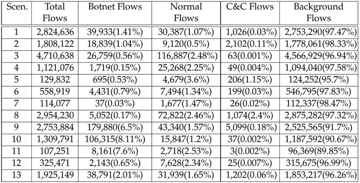
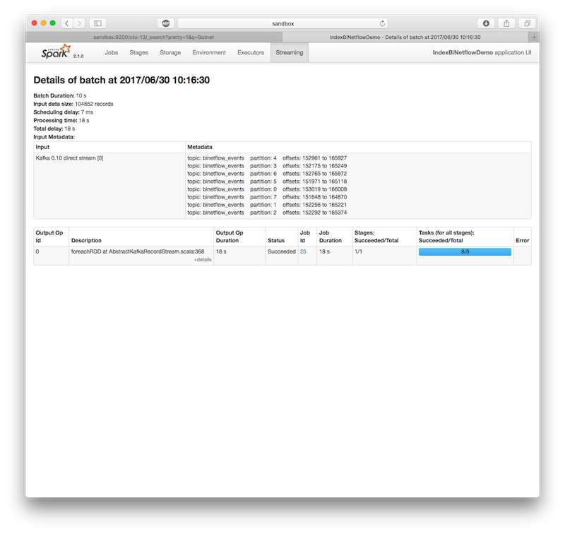
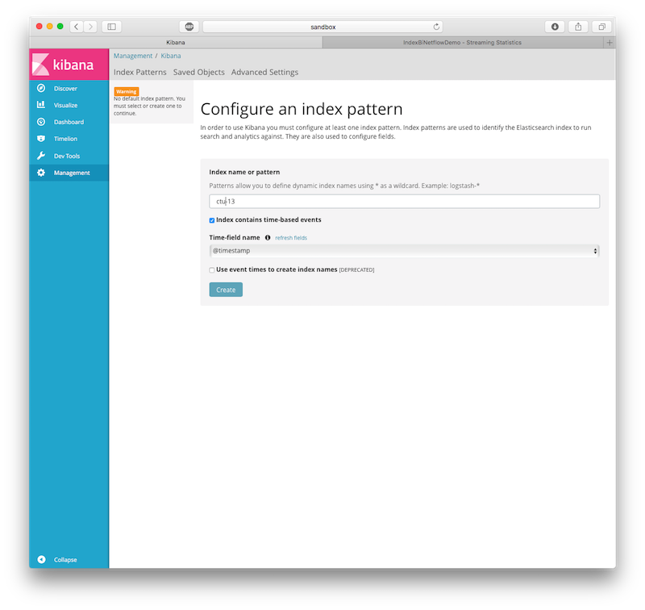

# logisland-flow-analytics-ml-jobs

- Introduction to Logisland
- The Malware Capture Facility Project
- Analyse CTU-13 birectionnal netflows with logisland

## Introduction to Logisland

LogIsland is an event processing framework based on Kafka and Spark. 
The main goal of this Open Source platform is to abstract the level of 
complexity of complex event processing at scale. Of course many people 
start with an ELK stack, which is really great but not enough to 
elaborate a really complete system monitoring tool. So with LogIsland, 
you'll move the log processing burden to a powerful distributed stack.

### Architecture
Kafka acts a the distributed message queue middleware while Spark is the core of the distributed processing.
LogIsland glue those technologies to simplify log complex event processing at scale.

### Goals

The main goal of LogIsland framework is to provide tools to automatically 
extract valuable knowledge from historical log data. To do so we need 
two different kind of processing over our technical stack :

1. Grab events from logs
2. Perform Event Pattern Mining (EPM)

What we know about ``Log``/``Event`` properties :

- they're naturally temporal
- they carry a global type (user request, error, operation, system failure...)
- they're semi-structured
- they're produced by software, so we can deduce some templates from them
- some of them are correlated
- some of them are frequent (or rare)
- some of them are monotonic
- some of them are of great interest for system operators

### Usage

LogIsland is an event mining scalable platform designed to handle a high throughput of events.

Here is an example of a typical event mining pipeline.

1. Raw events (sensor data, logs, user click stream, ...) are sent to Kafka topics by a NIFI / Logstash / *Beats / Flume / Collectd (or whatever) agent
2. Raw events are structured in Logisland Records, then processed and eventually pushed back to another Kafka topic by a Logisland streaming job
3. Records are sent to external short living storage (Elasticsearch, Solr, Couchbase, ...) for online analytics.
4. Records are sent to external long living storage (HBase, HDFS, ...) for offline analytics (aggregated reports or ML models).
5. Logisland Processors handle Records to produce Alerts and Information from ML models

## The Malware Capture Facility Project

The Malware Capture Facility Project is an effort from the Czech 
Technical University ATG Group for capturing, analyzing and publishing 
real and long-lived malware traffic.

[http://mcfp.weebly.com/analysis](http://mcfp.weebly.com/analysis)

The goals of the project are:

- To execute real malware for long periods of time.
- To analyze the malware traffic manually and automatically.
- To assign ground-truth labels to the traffic, including several botnet phases, attacks, normal and background.
- To publish these dataset to the community to help develop better detection methods.

### TOPOLOGY
The topology used in the project was designed to be as simple as 
possible. It uses VirtualBox to execute Windows virtual machines on 
Linux Hosts. The only two restrictions applied to the traffic are a 
bandwidth control to prevent DDoS and a redirection of all the SMTP 
traffic to prevent SPAM sending. 
More details can be found on the Topology page.

### PUBLISHING
The complete dataset is published and can be downloaded from the Dataset menu. The published files include:

- The pcap files of the malware traffic.
- The argus binary flow file.
- The text argus flow file.
- The text web logs
- A text file with the explanation of the experiment
- Several related files, such as the histogram of labels.

### COLLABORATION
If you find this project or the dataset useful please consider 
collaborating with it. Among the things that need more attention are 
a better labeling, more screenshots of the traffic and information about
 which malware it really is. Feel free to send an email to
  [sebastian.garcia@agents.fel.cvut.cz](mailto:sebastian.garcia@agents.fel.cvut.cz).
  
### BOTNET ANALYSIS
This dataset is directly feeding the CTU efforts for modelling and 
detecting botnets behavior on the network. As such, the Botnet Analysis
 blog page includes some analysis of their behaviors. 

### THE CTU-13 DATASET. A LABELED DATASET WITH BOTNET, NORMAL AND BACKGROUND TRAFFIC.

browse all public datasets [https://mcfp.felk.cvut.cz/publicDatasets/](https://mcfp.felk.cvut.cz/publicDatasets/)

The CTU-13 is a dataset of botnet traffic that was captured in the CTU 
University, Czech Republic, in 2011. The goal of the dataset was to 
have a large capture of real botnet traffic mixed with normal traffic 
and background traffic. The CTU-13 dataset consists in thirteen 
captures (called scenarios) of different botnet samples. 
On each scenario we executed a specific malware, which used several 
protocols and performed different actions. 

Table 2 shows the characteristics of the botnet scenarios.

Each scenario was captured in a pcap file that contains all the packets 
of the three types of traffic. These pcap files were processed to 
obtain other type of information, such as NetFlows, WebLogs, etc. 
The first analysis of the CTU-13 dataset, that was described and 
published in the paper "An empirical comparison of botnet detection 
methods" (see Citation below) used unidirectional NetFlows to represent 
the traffic and to assign the labels. These unidirectional NetFlows 
should not be used because they were outperformed by our second 
analysis of the dataset, which used bidirectional NetFlows. 
The bidirectional NetFlows have several advantages over the directional 
ones. First, they solve the issue of differentiating between the client 
and the server, second they include more information and third they 
include much more detailed labels. The second analysis of the dataset 
with the bidirectional NetFlows is the one published here. 

The relationship between the duration of the scenario, the number of 
packets, the number of NetFlows and the size of the pcap file is shown 
in Table 3. This Table also shows the malware used to create the 
capture, and the number of infected computers on each scenario.

Table 3. Amount of data on each botnet scenario

The distinctive characteristic of the CTU-13 dataset is that we 
manually analyzed and label each scenario. The labeling process was 
done inside the NetFlows files. Table 4 shows the relationship between 
the number of labels for the Background, Botnet, C&C Channels and 
Normal on each scenario. 

!(Table 4. Distribution of labels in the NetFlows for each scenario in the dataset.

### CTU-Malware-Capture-Botnet-42 or Scenario 1 in the CTU-13 dataset.

#### Description

- Probable Name: Neris
- MD5: bf08e6b02e00d2bc6dd493e93e69872f
- SHA1: 5c2ba68d78471ff02adcdab12b2f82db8efe2104
- SHA256: 527da5fd4e501765cdd1bccb2f7c5ac76c0b22dfaf7c24e914df4e1cb8029d71
- Password of zip file: infected
- Duration: 6.15 hours
- Complete Pcap size: 52GB
- Botnet Pcap size: 56MB
- NetFlow size: 1GB

- VirusTotal
- HybridAnalysis

    
    
#### Get the files

   
    wget https://mcfp.felk.cvut.cz/publicDatasets/CTU-Malware-Capture-Botnet-42/detailed-bidirectional-flow-labels/capture20110810.binetflow

#### IP Addresses

- Infected hosts
    - 147.32.84.165: Windows XP (English version) Name: SARUMAN (Label: Botnet) (amount of bidirectional flows: 40961)
- Normal hosts:
    - 147.32.84.170 (amount of bidirectional flows: 18438, Label: Normal-V42-Stribrek)
    - 147.32.84.164 (amount of bidirectional flows: 7654, Label: Normal-V42-Grill)
    - 147.32.84.134 (amount of bidirectional flows: 3808, Label: Normal-V42-Jist)
    - 147.32.87.36 (amount of bidirectional flows: 269, Label: CVUT-WebServer. This normal host is not so reliable since is a webserver)
    - 147.32.80.9 (amount of bidirectional flows: 83, Label: CVUT-DNS-Server. This normal host is not so reliable since is a dns server)
    - 147.32.87.11 (amount of bidirectional flows: 6, Label: MatLab-Server. This normal host is not so reliable since is a matlab server)

#### Important Label note

Please note that the labels of the flows generated by the malware start with "From-Botnet". The labels "To-Botnet" are flows sent to the botnet by unknown computers, so they should not be considered malicious perse. Also for the normal computers, the counts are for the labels "From-Normal". The labels "To-Normal" are flows sent to the botnet by unknown computers, so they should not be considered malicious perse.

#### Timeline

Wed ago 10 15:58:00 CEST 2011

Today we capture the neris bot along with the packets of the whole CTU department. We used an XP virtualbox machine with the 147.32.84.165 public ip address. The first hour of capture was only background and latter we run the malware until 5 minutes before ending. We limited the bandwith of the experiment to 20kbps in the output of the bot.

#### Traffic Analysis

The bot sent spam, connected to an HTTP CC, and use HTTP to do some ClickFraud.

## Analyse CTU-13 birectionnal netflows with logisland

### Start LogIsland as a Docker container

LogIsland is packaged as a Docker container that you can build yourself 
or pull from Docker Hub. The docker container is built from a 
Centos 6.4 image with the following tools enabled (among others)

- Kafka
- Spark
- Elasticsearch
- Kibana
- LogIsland

Let's setup the env by 

1. Pull the image from Docker Repository (it may take some time)

        docker pull hurence/logisland-jdev

    You should be aware that this Docker container is quite eager in 
    RAM and will need at least 8G of memory to run smoothly.

2. Now run the container

        # run container
        docker run \
            -it \
            -p 80:80 \
            -p 8080:8080 \
            -p 2055:2055 \
            -p 3000:3000 \
            -p 9200-9300:9200-9300 \
            -p 5601:5601 \
            -p 2181:2181 \
            -p 9092:9092 \
            -p 9000:9000 \
            -p 4050-4060:4050-4060 \
            --name logisland-jdev \
            -h sandbox \
            hurence/logisland-jdev bash
    
        # get container ip
        docker inspect logisland-jdev
    
        # or if your are on mac os
        docker-machine ip default

3. you should add an entry for **sandbox** (with the container ip) 
    in your ``/etc/hosts`` as it will be easier to access to all web 
    services in logisland running container.

> If you have your own Spark and Kafka cluster, you can download the 
`latest release <https://github.com/Hurence/logisland/releases>`_ and 
unzip on an edge node.
    
    

4. Retrieve one part of the dataset (should be already done in Docker image)

        cd /tmp;
        wget https://github.com/Hurence/logisland-flow-analytics-ml-jobs/releases/download/v0.1/capture20110810.binetflow.tgz;
        tar xzf capture20110810.binetflow.tgz;
        rm -f capture20110810.binetflow.tgz

6. init repository (should be already done in Docker image)

        cd /usr/local
        git clone https://github.com/Hurence/logisland-flow-analytics-ml-jobs.git;
        mvn compile assembly:single
        cp target/logisland-flow-analytics-ml-jobs-0.10.1.jar /usr/local/logisland/lib

### Understand logisland streaming job

A logisland job define some stream processing pipeline inside a simple 
yaml configuration file.

The first job can be found in `conf/index-binetflow.yml` configuration 
file defines a stream processing job for indexing events to elasticsearch. 

The first section configures the Spark engine 
(we will use a KafkaStreamProcessingEngine). A few notes about the most 
important parameters :

- `spark.master: local[*]` 
parameter specifies that we are running spark application locally. In 
a real environment we would set `spark.master: yarn-cluster` to schedule 
the processing within YARN.
- `spark.streaming.batchDuration: 10000` says that we run the processing 
by 10" micro-batches.
- `spark.streaming.kafka.maxRatePerPartition: 3000` says that for each 
micro-batch at most 3000 events will be processed by second and by partition

Here is the beginning of the conf file :

    version: 0.10
    documentation: LogIsland analytics main config file. Put here every engine or component config
    engine:
      component: com.hurence.logisland.engine.spark.KafkaStreamProcessingEngine
      type: engine
      documentation: Index some apache logs with logisland
      configuration:
        spark.app.name: IndexBiNetflowDemo
        spark.master: local[*]
        spark.driver.memory: 1G
        spark.driver.cores: 1
        spark.executor.memory: 1G
        spark.executor.instances: 4
        spark.executor.cores: 2
        spark.task.maxFailures: 8
        spark.serializer: org.apache.spark.serializer.KryoSerializer
        spark.streaming.batchDuration: 10000
        spark.streaming.backpressure.enabled: false
        spark.streaming.unpersist: false
        spark.streaming.blockInterval: 500
        spark.streaming.kafka.maxRatePerPartition: 3000
        spark.streaming.timeout: -1
        spark.streaming.unpersist: false
        spark.streaming.kafka.maxRetries: 30
        spark.streaming.ui.retainedBatches: 200
        spark.streaming.receiver.writeAheadLog.enable: false
        spark.ui.port: 4050

the following part of the configuration defines an Elasticsearch service 
that will be used later in the `BulkAddElasticsearch` processor. We define 
here elasticsearch `hosts: sandbox:9300`, the `cluster.name: elasticsearch` and 
the `batch.size: 5000`.

      controllerServiceConfigurations:
    
        - controllerService: elasticsearch_service
          component: com.hurence.logisland.service.elasticsearch.Elasticsearch_5_4_0_ClientService
          type: service
          documentation: elasticsearch 5.4.0 service implementation
          configuration:
            hosts: sandbox:9300
            cluster.name: elasticsearch
            batch.size: 5000
    
 The next part defines the stream itself which is made of 3 main topics list : 
 one for input records, one for output records and one for errors. Each of them 
 having a serialization class. Please note that here `kafka.input.topics.serializer` 
 is set to `com.hurence.logisland.serializer.KryoSerializer` because the input topic 
 `binetflow_events` contains Kryo serialized records that will be produced by another job.
 
 
      streamConfigurations:
    
    
        - stream: indexing_stream
          component: com.hurence.logisland.stream.spark.KafkaRecordStreamParallelProcessing
          type: stream
          documentation: a processor that links
          configuration:
            kafka.input.topics: binetflow_events
            kafka.output.topics: none
            kafka.error.topics: _errors
            kafka.input.topics.serializer: com.hurence.logisland.serializer.KryoSerializer
            kafka.output.topics.serializer: none
            kafka.error.topics.serializer: com.hurence.logisland.serializer.JsonSerializer
            kafka.metadata.broker.list: sandbox:9092
            kafka.zookeeper.quorum: sandbox:2181
            kafka.topic.autoCreate: true
            kafka.topic.default.partitions: 8
            kafka.topic.default.replicationFactor: 1

The final part of the strem configuration is the pipeline of `Processor` 
that will process the incoming `Records`. Here we simply use a `BulkAddElasticsearch` 
which will send incoming `Records` to Elasticsearch via the injected 
`elasticsearch.client.service`. Note that we provide both `default.index: ctu-13` 
and `default.type: bi_netflow` for elasticsearch documents but these 
settings can be overided by come fields in the `Record` itself, 
`es.index.field: search_index` and `es.type.field: record_type`.

          processorConfigurations:
    
            - processor: es_publisher
              component: com.hurence.logisland.processor.elasticsearch.BulkAddElasticsearch
              type: processor
              documentation: A processor that pushes Bro events into ES
              configuration:
                elasticsearch.client.service: elasticsearch_service
                default.index: ctu-13
                default.type: bi_netflow
                timebased.index: no
                es.index.field: search_index
                es.type.field: record_type      
      
      
The second job can be found in `conf/parse-binetflow.yml` configuration 
file defines a stream processing job to parse incoming netflow records. 
      
      
After `Engine` definition the `Stream` says that `Records` will be read
 from `kafka.input.topics: binetflow_raw`, processed and sent to 
 `kafka.output.topics: binetflow_events`

      streamConfigurations:
    
        - stream: parsing_stream
          component: com.hurence.logisland.stream.spark.KafkaRecordStreamParallelProcessing
          type: stream
          documentation: a processor that links
          configuration:
            kafka.input.topics: binetflow_raw
            kafka.output.topics: binetflow_events
            kafka.error.topics: _errors
            kafka.input.topics.serializer: none
            kafka.output.topics.serializer: com.hurence.logisland.serializer.KryoSerializer
            kafka.error.topics.serializer: com.hurence.logisland.serializer.JsonSerializer
            kafka.metadata.broker.list: sandbox:9092
            kafka.zookeeper.quorum: sandbox:2181
            kafka.topic.autoCreate: true
            kafka.topic.default.partitions: 8
            kafka.topic.default.replicationFactor: 1
            kafka.message.key.field: record_id
            
          processorConfigurations:
                      
 The pipeline of processor will start the processing chain by a 
 `SplitText` regexp processor which one will split all incoming lines accordingly 
 to `value.regex` field, each matching group identified by the `value.fields` 
 parameter, producing the following record from the line above 
  `2011/08/10 15:54:07.366830,0.002618,udp,93.79.39.15,10520,  <->,147.32.84.229,13363,CON,0,0,2,520,460,flow=Background-UDP-Established`
 
        {
            "@timestamp": "2011-08-10T13:54:07Z",
            "bytes_in": 460,
            "bytes_out": 520,
            "dest_ip": "147.32.84.229",
            "dest_port": "13363",
            "dest_tos": 0,
            "direction": "  <->",
            "duration": 0.002618,
            "label": "Background-UDP-Established",
            "packets_out": 2,
            "protocol": "udp",
            "record_id": "1312984447366-93.79.39.15-147.32.84.229",
            "record_raw_value": "2011/08/10 15:54:07.366830,0.002618,udp,93.79.39.15,10520,  <->,147.32.84.229,13363,CON,0,0,2,520,460,flow=Background-UDP-Established",
            "record_time": 1312984447366,
            "record_type": "bi_netflow",
            "src_ip": "93.79.39.15",
            "src_port": "10520",
            "src_tos": 0,
            "state": "CON",
            "timestamp": "2011/08/10 15:54:07.366830"
          }
          
  here is the conf :        
 
    
            - processor: bi_netflow_parser
              component: com.hurence.logisland.processor.SplitText
              type: parser
              documentation: a parser that produce events from bi-directionnal netflow logs
              configuration:
                record.type: bi_netflow
                value.regex: (\d{4}\/\d{2}\/\d{2}\s\d{1,2}:\d{1,2}:\d{1,2}\.\d{0,6}),([^,]+)?,([^,]+)?,([^,]+)?,([^,]+)?,([^,]+)?,([^,]+)?,([^,]+)?,([^,]+)?,([^,]+)?,([^,]+)?,([^,]+)?,([^,]+)?,([^,]+)?,flow=([^,]+)
                value.fields: timestamp,duration,protocol,src_ip,src_port,direction,dest_ip,dest_port,state,src_tos,dest_tos,packets_out,bytes_out,bytes_in,label
    
 as the previous Processor as juste produced text fields we will convert  
 them to the desired types with `ConvertFieldsType` 
    
            - processor: field_types_converter
              component: com.hurence.logisland.processor.ConvertFieldsType
              type: processor
              documentation: convert some field to a given type
              configuration:
                bytes_in: long
                bytes_out: long
                packets_out: long
                duration: float
                src_tos: int
                dest_tos: int
    
 The date of the Netflow file is converted with a custom Java Processor
 `UpdateBiNetflowDate` 
 
            - processor: date_updater
              component: com.hurence.logisland.processor.UpdateBiNetflowDate
              type: processor
              documentation: compute record_time
    
    
 Here is the java code of the date updater. this component is built in 
 an external jar module which has to be copied into `$LOGISLAND_HOME/lib` 
 folder
 
     package com.hurence.logisland.processor;
     
     import com.hurence.logisland.annotation.documentation.CapabilityDescription;
     import com.hurence.logisland.annotation.documentation.Tags;
     import com.hurence.logisland.component.PropertyDescriptor;
     import com.hurence.logisland.logging.ComponentLog;
     import com.hurence.logisland.logging.StandardComponentLogger;
     import com.hurence.logisland.record.FieldDictionary;
     import com.hurence.logisland.record.FieldType;
     import com.hurence.logisland.record.Record;
     
     import java.text.SimpleDateFormat;
     import java.util.*;
     
     
     @Tags({"record", "fields", "post-process", "binetflow", "date"})
     @CapabilityDescription("Post processing step to update a dte field in a custom way")
     public class UpdateBiNetflowDate extends AbstractProcessor {
     
         private final ComponentLog logger = new StandardComponentLogger("UpdateBiNetflowDate", this);
     
     
         @Override
         public Collection<Record> process(ProcessContext context, Collection<Record> records) {
             SimpleDateFormat sdf = new SimpleDateFormat("yyyy/MM/dd HH:mm:ss.S");
             sdf.setTimeZone(TimeZone.getTimeZone("GMT+1"));
             for (Record outputRecord : records) {
     
     
                 try {
                     String eventTimeString = outputRecord.getField("timestamp").asString();
                     Date eventDate = sdf.parse(eventTimeString.substring(0, eventTimeString.length() - 3));
     
                     if (eventDate != null) {
                         outputRecord.setField(FieldDictionary.RECORD_TIME, FieldType.LONG, eventDate.getTime() - 60 * 60 * 1000);
                     }
                 } catch (Exception e) {
                     String error = "error parsing in record: " + outputRecord + ", " + e.toString();
                     outputRecord.addError("unable to parse date", logger, error);
                 }
     
             }
             return records;
         }
     
         @Override
         public List<PropertyDescriptor> getSupportedPropertyDescriptors() {
             return Collections.emptyList();
         }
     }

    
 Lastly, in order to make the processing idempotent, we modify the Record id 
 according to the pattern `<record_time>-<src_ip>-<dest_ip>`
   
    
            - processor: id_modifier
              component: com.hurence.logisland.processor.ModifyId
              type: processor
              documentation: convert some field to a given type
              configuration:
                id.generation.strategy: fromFields
                fields.to.hash: record_time,src_ip,dest_ip
                java.formatter.string: "%s-%s-%s"
      
### Run the jobs
      
      
1. create the index into Elasticsearch

        # send mapping
        curl -XPUT http://sandbox:9200/ctu-13 -d @conf/ctu-13-mapping.json 
        
        # verify that the index is correct
        curl -XGET http://sandbox:9200/ctu-13?pretty=1
        
2. Start a logisland job that will index incoming records

        cd /usr/local/logisland
        bin/logisland.sh --conf /usr/local/logisland-flow-analytics-ml-jobs/conf/index-binetflow.yml
    
    
3. Start a logisland job that will parse incoming bidirectionnal netflow 
events.
  
        bin/logisland.sh --conf /usr/local/logisland-flow-analytics-ml-jobs/conf/parse-binetflow.yml 
    
    
4. send some records to Logisland through Kafka topic with `kafkacat`

        cat /tmp/capture20110810.binetflow | kafkacat -b sandbox:9092 -t binetflow_raw
        
        
5. find all botnet events in elasticsearch    
    
        curl -XGET http://sandbox:9200/ctu-13/_search?pretty=1&q=Botnet
    
6. Checkout spark streaming application in your browser at [http://sandbox:4050](http://sandbox:4050)

drill down to a batch detail

drill down to a stage detail

7. go to kibana web ui [http://sandbox:5601](http://sandbox:5601) to setup `ctu-13` index

then click on `Discover` and adjust absolute time range filter (top right) 
from `2011-08-10 09:00:00.000` to `2011-08-10 18:00:00.000`

enter `Botnet` in the search bar to search only Botnet flows. 
click on some fields to see Quick counts

## Network footprint analysis through Machine learning

In this lab will show how to experiment some Machine Learning on a labeled dataset with both Logisland and Spark MLLib. We will make a small Spark job which will use some of the Logisland processors that we have already been using in conjonction with a cyber-security plugin called `botsearch`.

### Botsearch algorithm

`botsearch` tries to detects malware infections in network traffic by comparing statistical features of the traffic to previously-observed bot activity. Therefore, `botsearch` operates in two phases: a training phase and a detection phase. 

During the training phase, `botsearch` learns the statistical properties that are characteristic of the command and control traffic of different bot families. Then, it uses these statistical properties to create models that can identify similar traffic. In the detection phase, the models are applied to the traffic under investigation. This allows `botsearch` to identify potential bot infections in the network, even when the bots use encrypted C&C communication.

First, we need to obtain input for our system. In the training phase, this input is generated by executing malware samples in a controlled environment and capturing the traffic that these samples produce. In the second step, we reassemble the flows in the captured traffic; a step that can be omitted when NetFlow data is used instead of full packet captures. In the third step, we aggregate the flows in traces – chronologically-ordered sequences of connections between two
IP addresses on a given destination port. `botsearch` then extracts five statistical features for each trace in the forth step. These statistical features are :

- the average time between the start times of two subsequent flows in the trace
- the average duration of a connection
- the number of bytes on average transferred to the source
- the number of bytes on average transferred to the destination
- a Fourier Transformation over the flow start times in the trace. 

The latter allows us to identify underlying frequencies of communication that might not be captured by using simple averages.
 
Finally, in the fifth step, `botsearch` leverages the aforementioned features to build models. During model creation, `botsearch` clusters the observed feature values. Each feature is treated separately to reflect the fact that we did not always observe correlations between features: For example, a malware family might exhibit similar periodicity between their C&C communications, but each connection transmits a very different number of bytes. The combination of multiple clusters for each of a bot’s features produces the final malware family model.

### Bootstrap the application

This app has been written in Java, it would have been mush simpler in Scala...
We first need a spark context :

    // Initialize Spark configuration & context
    String appName = "KMeansClustering";
    SparkConf sparkConf = new SparkConf()
            .setAppName(appName)
            .setMaster("local[*]")
            .set("spark.executor.memory", "3g");
    JavaSparkContext sc = new JavaSparkContext(sparkConf);

We read data file from file system and return it as RDD of strings:

    JavaRDD<String> linesRDD = sc.textFile(inputPathFile);

the we initialize 2 logisland processors that has previously been used in parsing job.
One to split the string according to regexp groups, the other to adjust the business date.

    // Split Text Processor :
    Processor splitTextProcessor = new SplitText();
    StandardProcessContext splitTextContext = new StandardProcessContext(splitTextProcessor, "splitTextProcessor");
    splitTextContext.setProperty("value.fields", "timestamp,duration,protocol,src_ip,src_port,direction,dest_ip,dest_port,state,src_tos,dest_tos,packets_out,bytes_out,bytes_in,label");
    splitTextContext.setProperty("value.regex", "(\\d{4}\\/\\d{2}\\/\\d{2}\\s\\d{1,2}:\\d{1,2}:\\d{1,2}\\.\\d{0,6}),([^,]+)?,([^,]+)?,([^,]+)?,([^,]+)?,([^,]+)?,([^,]+)?,([^,]+)?,([^,]+)?,([^,]+)?,([^,]+)?,([^,]+)?,([^,]+)?,([^,]+)?,flow=([^,]+)");

    // BiNetFlow Processor :
    Processor updateBiNetflowDate = new UpdateBiNetflowDate();
    StandardProcessContext updateBiNetflowDateContext = new StandardProcessContext(updateBiNetflowDate, "updateBiNetflowDate");

We then use those 2 `Logisland` Processors to create a distributed dataset of netflow `Records`.
This step will produce a distributed collection of (String, Record) tupples.
The key of the tupple is a string formed with `<src_ip>_<dest_ip>` and the value is the netflow Record itself

    PairFunction<String, String, Record> mapFunction = new PairFunction<String, String, Record>() {
        public Tuple2<String, Record> call(String line) {

            Record r = RecordUtils.getKeyValueRecord("", line);
            List<Record> list = new ArrayList<>();
            list.add(r);
            Collection<Record> tempRecords = splitTextProcessor.process(splitTextContext, list);
            Collection<Record> records = updateBiNetflowDate.process(updateBiNetflowDateContext, tempRecords);

            try {
                Record record = records.iterator().next();
                String ipSource = record.getField("src_ip").asString();
                String ipTarget = record.getField("dest_ip").asString();

                return new Tuple2<>(ipSource + "_" + ipTarget, record);
            } catch (Exception ex) {
                return new Tuple2<>("unknown", null);
            }
        }
    };

    JavaPairRDD<String, Record> flowsRDD = linesRDD.mapToPair(mapFunction);
    
    
then comes the major step, the trace computation. We will first group all the records by key.
convert them to HttpFlow, sort them by date and compute the traces.

The trace computation algorithm can be describe by the following steps :

1. we compute some flow statistics: loop around flows to compute the average time interval between two flows, the average uploaded byte amount as well as downloaded byte amount, the smallestTimeInterval and the biggestTimeInterval between all the netflows.
2. We represents our trace like a binary signal by assigning it to be 1 at each connection start, and 0 in-between connections. To calculate a high-quality FFT, we've used a sampling intervalof 1=4th of the smallest time interval in the trace, which ensures thatwe do not undersample. However, if the distance between two netflows is extremely small and large gaps occur between other flows of the trace, this sampling method can lead to a Significant amount of data points. In such cases, we limit the length of our FFT trace to 2^16 = 65 536 datapoints and accept minor undersampling. We chose this value as the FFT is fastest for a length of power of two
3. In the next step, we compute the Power Spectral Density (PSD) of the Fast Fourier Transformation over our sampled trace and extract the most significant frequency. The FFT peaks are correlated with time periodicities and resistant against irregular large gaps in the trace. We observed the introduction of gaps in the wild for bots in which communication with the C&C server is periodic and then pauses for a while. When malware authors randomly vary the C&C connection frequency within a certain window, the random variation lowers the FFT peak. However, the peak remains detectable and at the same frequency, enabling the detection of the malware communication.

Here is the code :

    JavaPairRDD<String, NetworkTrace> traces = flowsRDD
        .groupByKey()
        .map(t -> {
            Trace trace = new Trace();
            try {
                Iterable<Record> flowRecords = t._2;
                String[] tokens = t._1.split("_");
    
                trace.setIpSource(tokens[0]);
                trace.setIpTarget(tokens[1]);
    
                // set up the flows buffer
                ArrayList<HttpFlow> flows = new ArrayList<>();
                flowRecords.forEach(flowRecord -> {
                    HttpFlow flow = new HttpFlow();
                    flow.setDate(new java.util.Date(flowRecord.getField("record_time").asLong()));
                    flow.setipSource(flowRecord.getField("src_ip").asString());
                    flow.setIpTarget(flowRecord.getField("dest_ip").asString());
                    flow.setRequestSize(flowRecord.getField("bytes_in").asLong());
                    flow.setResponseSize(flowRecord.getField("bytes_out").asLong());
                    flows.add(flow);
                });
    
                // we need at least 5 flows to compute one trace
                if (flows.size() > 5) {
                    // flows need to be sorted on timestamp
                    flows.sort(new Comparator<HttpFlow>() {
                        @Override
                        public int compare(HttpFlow flow2, HttpFlow flow1) {
                            return flow1.getDate().compareTo(flow2.getDate());
                        }
                    });
    
                    flows.forEach(trace::add);
    
                    // compute trace frequencies and stats
                    trace.compute();
                }
            } catch (Exception ignored) {
    
            }
    
            return trace;
        })
        .mapToPair(trace -> new Tuple2<String, NetworkTrace>(
                trace.getIpSource() + "_" + trace.getIpTarget(), 
                new NetworkTrace(
                    trace.getIpSource(),
                    trace.getIpTarget(),
                    (float) trace.getAvgUploadedBytes(),
                    (float) trace.getAvgDownloadedBytes(),
                    (float) trace.getAvgTimeBetweenTwoFLows(),
                    (float) trace.getMostSignificantFrequency(),
                    trace.getFlows().size(),
                    "",
                    0)))
        .cache();

Now we'll go into the vectorization of the traces, and transform them into 
a dense 4 dimensions vector

    // Convert traces into a Dense vector
    JavaRDD<Tuple2<String, Vector>> tracesTuple = traces.map(t -> {
        double[] values = new double[4];
        values[0] = t._2.avgUploadedBytes();
        values[1] = t._2.avgDownloadedBytes();
        values[2] = t._2.avgTimeBetweenTwoFLows();
        values[3] = t._2.mostSignificantFrequency();
        return new Tuple2<>(t._1, Vectors.dense(values));
    }).cache();
    
  
Don't forget to scale the vector to get mean = 0 and std = 1 elsewhere you'll get a pretty 
huge bias as we will compare carots and cauliflowers.

    StandardScaler scaler = new StandardScaler(true, true);
    RDD<Vector> tracesVector = tracesTuple.map(tv -> tv._2).rdd();
    StandardScalerModel scalerModel = scaler.fit(tracesVector);
    JavaRDD<Tuple2<String, Vector>> scaledTraces = tracesTuple.map(x -> new Tuple2<>(x._1, scalerModel.transform(x._2)));
    
Now that we have some well formed scaled vectors of features, we can run 
K-means clustering to segment our traces.

    

    // Cluster the data into two classes using KMeans k:$nbClusters, nbIterations:$nbIterations
    KMeansModel clusters = KMeans.train(scaledTraces.map(x -> x._2).rdd(), nbClusters, nbIterations);
    
    // Display cluster centers :
    displayClustersCenters(clusters);

At this step, we have computed a kmeans model, made of 4-dimension centroids. 
And we can assign a clusterId to each trace. And finally we send the whole traces
to Kafka, on the same topic as the previous stream, so that the logisland indexing stream 
can also handle theses trace events too.

    // Assign traces to clusters
    JavaPairRDD<String, Integer> centroids = scaledTraces.mapToPair(t -> new Tuple2<>(t._1, clusters.predict(t._2)));

    // Assign centroidId to traces
    centroids.join(traces, 8).foreachPartition(it -> {

        //Configure the Producer
        Properties configProperties = new Properties();
        configProperties.put(ProducerConfig.BOOTSTRAP_SERVERS_CONFIG, "sandbox:9092");
        configProperties.put(ProducerConfig.KEY_SERIALIZER_CLASS_CONFIG, "org.apache.kafka.common.serialization.ByteArraySerializer");
        configProperties.put(ProducerConfig.VALUE_SERIALIZER_CLASS_CONFIG, "org.apache.kafka.common.serialization.ByteArraySerializer");

        Producer producer = new KafkaProducer(configProperties);
        it.forEachRemaining( t -> {

            String traceId = t._1();
            int centroidId = t._2()._1();
            NetworkTrace trace = t._2()._2();

            Record record = new StandardRecord("botsearch_trace")
                    .setStringField("search_index", "ctu-13")
                    .setId(traceId)
                    .setField("centroid_id", FieldType.STRING, centroidId)
                    .setField("src_ip", FieldType.STRING, trace.ipSource())
                    .setField("dest_ip", FieldType.STRING, trace.ipTarget())
                    .setField("avg_uploaded_bytes", FieldType.FLOAT, trace.avgUploadedBytes())
                    .setField("avg_downloaded_bytes", FieldType.FLOAT, trace.avgDownloadedBytes())
                    .setField("avg_time_between_two_fLows", FieldType.FLOAT, trace.avgTimeBetweenTwoFLows())
                    .setField("most_significant_frequency", FieldType.FLOAT, trace.mostSignificantFrequency())
                    .setField("flows_count", FieldType.LONG, trace.flowsCount());

            RecordSerializer serializer = new KryoSerializer(true);
            ByteArrayOutputStream baos = new ByteArrayOutputStream();
            serializer.serialize(baos, record);

            ProducerRecord<byte[], byte[]> rec = new ProducerRecord<>("binetflow_events", traceId.getBytes(), baos.toByteArray());
            producer.send(rec);
            try {
                baos.close();
            } catch (IOException e) {
                e.printStackTrace();
            }
        });
        producer.close();

    });

### Run the clustering

1. We will launch the clustering job with the `/tmp/capture20110810.binetflow` file and save the centroids in one file called `/tmp/clusters.txt`. Just start with 10 clusters and 10 iterations.

        cd /usr/local/logisland-flow-analytics-ml-jobs
        /usr/local/spark/bin/spark-submit --class com.hurence.logisland.jobs.KMeansClustering --driver-memory 8g target/logisland-flow-analytics-ml-jobs-0.10.1-jar-with-dependencies.jar -nbClusters 10 -nbIterations 10 -inputPath /tmp/capture20110810.binetflow -outputPath /tmp/clusters.txt

2. The resulting centroid should look like the following :

        Cluster Center 0: [ 'Average uploaded bytes': -0.004762804352565624, 'Average downloaded bytes': -0.006434461345251199, 'Average time between two flows': 0.1714331420028378, 'Most Significant Frequency': -0.19472068689355237 ]
        Cluster Center 1: [ 'Average uploaded bytes': 23.847880147671972, 'Average downloaded bytes': 388.6130233752165, 'Average time between two flows': -4.587405304268049, 'Most Significant Frequency': 2.180556475503876 ]
        Cluster Center 2: [ 'Average uploaded bytes': 633.756107444736, 'Average downloaded bytes': 170.41500459257244, 'Average time between two flows': -1.2520176112615478, 'Most Significant Frequency': 5.488399613909684 ]
        Cluster Center 3: [ 'Average uploaded bytes': 0.03249432630082737, 'Average downloaded bytes': 0.01976826657423998, 'Average time between two flows': -7.611985863898892, 'Most Significant Frequency': 3.6782110287686467 ]
        Cluster Center 4: [ 'Average uploaded bytes': 0.04291827526782946, 'Average downloaded bytes': 0.031986211635606186, 'Average time between two flows': -1.070165821772272, 'Most Significant Frequency': 7.682881299532897 ]
        Cluster Center 5: [ 'Average uploaded bytes': 0.08512160297573648, 'Average downloaded bytes': 0.14225052937437158, 'Average time between two flows': -1.1382353609756743, 'Most Significant Frequency': 3.366819813123287 ]
        Cluster Center 6: [ 'Average uploaded bytes': 316.2511432025284, 'Average downloaded bytes': 121.52914874544881, 'Average time between two flows': -4.800965640138641, 'Most Significant Frequency': 3.500625104482574 ]
        Cluster Center 7: [ 'Average uploaded bytes': 9.359717794125272, 'Average downloaded bytes': 101.44540188177837, 'Average time between two flows': -2.918521013590664, 'Most Significant Frequency': 2.663547817590244 ]
        Cluster Center 8: [ 'Average uploaded bytes': 132.49639037888568, 'Average downloaded bytes': 43.85958413673529, 'Average time between two flows': -4.795757418834234, 'Most Significant Frequency': 4.001404480917403 ]
        Cluster Center 9: [ 'Average uploaded bytes': 0.012003654687921273, 'Average downloaded bytes': 0.014284479381833907, 'Average time between two flows': -4.12222261451248, 'Most Significant Frequency': 4.311217671762223 ]

3.  Try some visual analytics of thoses cluster. GO to Kibana and update the CTU-13 index parttern in the `management` section. Go in the discover section and look at the latest events (indexed during the latest 15'). Filter to keep only those which have more than 0 `flow_count`. Try to compare clusterId repartition for src_ip: 147.32.84.165 and other traces.

